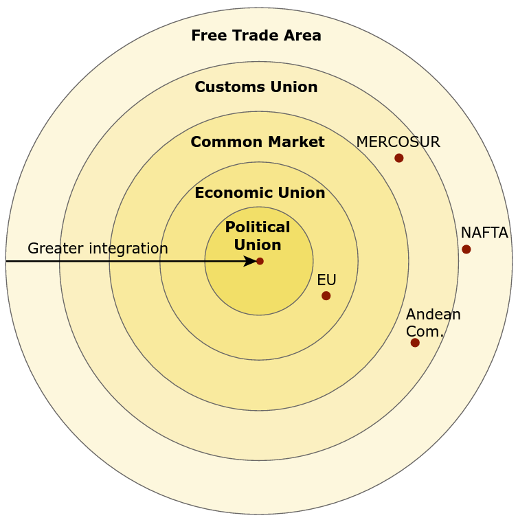

```{r setup, include = FALSE}
knitr::opts_chunk$set(echo      = FALSE, 
                      warning   = FALSE, 
                      message   = FALSE,
                      fig.align = "center")
```

```{r libraries}

library(tidyverse)
library(rnaturalearth)
library(ISOcodes)
library(countrycode)
library(tidyquant)
library(knitr)
library(kableExtra)
```

# Contents

- Please Read Me
- Purpose
- Regional trade agreements (RTA)
- Level of integration
- Regional integration in Europe
- Regional integration in North America
- Regional integration in Central America and the Caribbean
- Regional integration in South America
- Regional integration in Africa
- Regional integration in the Middle East
- Regional integration in Asia
- Regional integration in Oceania
- Acknowledgments
- References

# Please Read Me

- Check the message __Welcome greeting__ published in the News Bulletin Board.

- Dear student please edit your profile uploading a photo where your face is clearly visible.

- The purpose of the virtual meetings is to answer questions and not to make a summary of the study material.

- This presentation is based on [@wild_international_2020, Chapter 8]

# Purpose

Explore and outline the trend toward greater economic integration of the national economies and its debate

# Regional trade agreements (RTA)

- A regional trade agreement (RTA) is a treaty between two or more countries that specify the rules of trade

- Where can I find information about the RTA around the world?

    + Regional Trade Agreements Database: 
    
        + https://rtais.wto.org > Explore the data >  Export all RTAs
    
    + Market access map: 
    
        + https://www.macmap.org/ > Analyze markets

# Regional trade agreements (RTA)

```{r, out.width="95%"}

# European Union countries
european_union <- countrycode::codelist_panel %>%
  # United Kingdom is not part of the European Union
  filter(!is.na(eu28) & year == 2020 & country.name.en != "United Kingdom") %>% 
    pull(country.name.en) %>% 
    str_c(collapse = "; ")

# EFTA countries
efta <- codelist_panel %>%
                       # Iceland, Liechtenstein, Norway, Switzerland   
    filter((iso3c %in% c("ISL", "LIE", "NOR", "CHE")) & year == 2020) %>% 
    pull(country.name.en) %>% 
    str_c(collapse = "; ")

# Raw data
rta_col <- read_csv("003_all_rta.csv") %>% 
    filter(str_detect(string = `Current signatories`, pattern = "Colombia"),
           Status == "In Force") %>%
    select(`RTA Name`, `Current signatories`) %>%
    filter(!str_detect(string = `RTA Name`, pattern = "Accession")) %>%
    separate_rows(`Current signatories`, sep = ";") %>% 
    mutate(`Current signatories` = str_trim(`Current signatories`, side = "both")) %>% 
    mutate(`Current signatories` = case_when(
        `Current signatories` == "European Union" ~ european_union,
        `Current signatories` == "European Free Trade Association (EFTA)" ~ efta,
        `Current signatories` == "Iran" ~ "Iran, Islamic Republic of", 
        `Current signatories` == "Tanzania" ~ "Tanzania, United Republic of",
        `Current signatories` == "United States of America" ~ "United States", 
        TRUE ~ `Current signatories`)) %>%
    separate_rows(`Current signatories`, sep = ";") %>% 
    mutate(`Current signatories` = str_trim(`Current signatories`, side = "both")) %>%
    left_join(y = ISO_3166_1 %>% 
                  as_tibble() %>% 
                  select(Alpha_3, Name), by = c("Current signatories" = "Name")) %>% 
    filter(`Current signatories` != "Colombia") %>%
    select(`RTA Name`, Alpha_3) %>% 
    set_names(c("rta_name", "iso_alpha_3")) %>% 
    count(iso_alpha_3, name = "n_rta")

rnaturalearth::ne_countries(scale = 10, returnclass = "sf") %>%
  select(iso_a3, admin, geometry) %>% 
  left_join(rta_col, by = c("iso_a3" = "iso_alpha_3")) %>% 
  replace_na(replace = list(n_rta = 0)) %>%
  mutate(n_rta = as.character(n_rta),
         n_rta = case_when(
           iso_a3 == "COL" ~ "Colombia",
           TRUE ~ n_rta),
         n_rta = fct_relevel(n_rta, c("0", "1", "2", "3", "4", "5", "6", "Colombia"))) %>%
  
    # Plot
    ggplot() +
    geom_sf(aes(geometry = geometry, fill = n_rta), color = "black", alpha = 0.5) + 
    scale_fill_manual(values = c("white", palette_light()[1:7])) +
    labs(fill     = "Number of RTAs",
         title    = "Number of RTAs in force with Colombia by country reported to WTO",
         caption  = str_glue("Source data: RTA database - WTO & OMC,
                              Last update data: 2021-02-04,
                              Source data map: Natural Earth")) +
    theme(panel.border      = element_rect(fill = NA, color = "black"),
          plot.background   = element_rect(fill = "#f3fcfc"),
          panel.background  = element_rect(fill = "#f3f7fc"),
          panel.grid        = element_blank(),
          legend.background = element_rect(fill = "#f3fcfc"),
          plot.title        = element_text(face = "bold"),
          legend.title      = element_text(face = "bold"), 
          legend.position   = "bottom")

```

# Level of integration

- Degrees of economical and political integration for regional trading blocs according to [@wild_international_2020, Fig 8.1] 

```{r, out.width="50%"}


```

# Level of integration

- Types of RTAs notify to the WTO

    + __Free Trade Agreement (FTA)__ 
    
        + "Two or more customs territories in which the duties and other restrictive regulations of commerce ... are eliminated on substantially all the trade between the constituent territories in products originating in such territories ..." [@wto_wto_2020, Article XXIV, 8 (b) - GATT 1994] 
        
    + __Customs Union (CU)__
    
        + "The substitution of a single customs territory for two or more customs territories ..." [@wto_wto_2020, Article XXIV, 8 (a) - GATT 1994]

    + __Economic Integration Agreement (EIA)__ 
    
        + This type of integration is described in [@wto_wto_2020-1, Article V]
    
    + __Partial Scope Agreement (PSA)__
    
        + The agreement covers only certain products and must be notified according to [@wto_wto_2020-2, 4 - Decision of 28 November 1979 (L/4903)]
        
# Level of integration

```{r}

read_csv("003_all_rta.csv") %>% 
    filter(str_detect(string = `Current signatories`, pattern = "Colombia"),
           Status == "In Force", 
           !str_detect(string = `RTA Name`, pattern = "Accession")) %>% 
    select(`RTA Name`, Type) %>% 
    kable(format = "latex", booktabs = TRUE, caption = "Colombia RTAs in force by type reported to WTO") %>% 
    kable_styling(font_size = 7, latex_options = "striped") %>% 
    row_spec(row = 0, bold = TRUE) %>% 
    footnote(number = c("Source: RTA database - WTO & OMC", "Last update: 2020-02-04"))
```

# Integration in Europe

```{r, out.width="90%"}

eu_efta <- codelist_panel %>%
    filter((!is.na(eu28) | (iso3c %in% c("ISL", "LIE", "NOR", "CHE"))) & year == 2020 & (iso3c != "GBR")) %>% 
    select(eu28, iso3c) %>%
    set_names(nm = c("trade_region", "iso_a3")) %>% 
    mutate(trade_region = case_when(
        is.na(trade_region) ~ "EFTA",
        TRUE ~ trade_region))

ne_countries(returnclass = "sf", type = "countries", scale = 10) %>%
    select(adm0_a3, admin, geometry) %>% 
    left_join(y = eu_efta, by = c("adm0_a3" = "iso_a3")) %>% 
    mutate(trade_region = case_when(
        is.na(trade_region) ~ "Not in EFTA or EU",
        TRUE ~ trade_region),
        trade_region = fct_relevel(trade_region, c("Not in EFTA or EU", "EFTA", "EU"))) %>% 
    
    # Plot
    ggplot() +
    geom_sf(aes(geometry = geometry, fill = trade_region), color = "black", alpha = 0.5)  + 
    scale_fill_manual(values = c("white", palette_light()[1:2])) +
    coord_sf(xlim = c(-25, 60), ylim = c(35, 80)) +
    labs(fill     = "",
         title    = "European Free Trade Association (EFTA) and European Union (EU)",
         caption  = str_glue("Source data map: Natural Earth")) +
    theme(panel.border      = element_rect(fill = NA, color = "black"),
          plot.background   = element_rect(fill = "#f3fcfc"),
          panel.background  = element_rect(fill = "#f3f7fc"),
          panel.grid        = element_blank(),
          legend.background = element_rect(fill = "#f3fcfc"),
          plot.title        = element_text(face = "bold"),
          axis.title        = element_text(face = "bold"),
          legend.title      = element_text(face = "bold"),
          axis.text         = element_blank(),
          axis.ticks        = element_blank())
```

# Integration in North America

```{r, out.width="90%"}

ne_countries(returnclass = "sf", type = "countries", scale = 10) %>%
    select(adm0_a3, admin, geometry) %>% 
    mutate(trade_region = case_when(
                            adm0_a3 %in% c("CAN", "MEX", "USA") ~ "USMCA",
                            TRUE ~ "Not in USMCA"),
        trade_region = fct_relevel(trade_region, c("Not in USMCA", "USMCA"))) %>% 
    
    # Plot
    ggplot() +
    geom_sf(aes(geometry = geometry, fill = trade_region), color = "black", alpha = 0.5)  + 
    scale_fill_manual(values = c("white", palette_light()[1])) +
    coord_sf(xlim = c(-180, -50), ylim = c(15, 80)) +
    labs(fill     = "",
         title    = "United States, Mexico, Canada Agreement (USMCA)",
         caption  = str_glue("Source data map: Natural Earth")) +
    theme(panel.border      = element_rect(fill = NA, color = "black"),
          plot.background   = element_rect(fill = "#f3fcfc"),
          panel.background  = element_rect(fill = "#f3f7fc"),
          panel.grid        = element_blank(),
          legend.background = element_rect(fill = "#f3fcfc"),
          plot.title        = element_text(face = "bold"),
          axis.title        = element_text(face = "bold"),
          legend.title      = element_text(face = "bold"),
          axis.text         = element_blank(),
          axis.ticks        = element_blank())
```

# Integration in Central America and the Caribbean

```{r, out.width="90%"}

ne_countries(returnclass = "sf", type = "countries", scale = 10) %>%
    select(adm0_a3, admin, geometry) %>%
    mutate(trade_region = case_when(
                                           # https://www.sica.int/
                            adm0_a3 %in% c("CRI", "SLV", "GTM", 
                                           "HND", "NIC", "PAN",
                                           "DOM")              ~ "SICA",
                            adm0_a3 %in% c("ATG", "BHS", "BRB",
                                           "DMA", "GRD", "GUY", 
                                           "HTI", "JAM", "MSR", 
                                           "KNA", "LCA", "VCT", 
                                           "SUR", "TTO")        ~ "CARICOM",
                            adm0_a3 %in% c("BLZ")               ~ "SICA and CARICOM", 
                            TRUE ~ "Not in SICA or CARICOM"),
        trade_region = fct_relevel(trade_region, c("Not in SICA or CARICOM", 
                                                   "SICA", "CARICOM",
                                                   "SICA and CARICOM"))) %>% 
    
    # Plot
    ggplot() +
    geom_sf(aes(geometry = geometry, fill = trade_region), color = "black", alpha = 0.5)  + 
    scale_fill_manual(values = c("white", palette_light()[1:3])) +
    coord_sf(xlim = c(-95, -50), ylim = c(0, 30)) +
    labs(fill     = "",
         title    = str_glue("Central American Integration System (SICA) and 
                             Caribbean Community and Common Market (CARICOM)"),
         caption  = str_glue("Source data map: Natural Earth")) +
    theme(panel.border      = element_rect(fill = NA, color = "black"),
          plot.background   = element_rect(fill = "#f3fcfc"),
          panel.background  = element_rect(fill = "#f3f7fc"),
          panel.grid        = element_blank(),
          legend.background = element_rect(fill = "#f3fcfc"),
          plot.title        = element_text(face = "bold"),
          axis.title        = element_text(face = "bold"),
          legend.title      = element_text(face = "bold"),
          axis.text         = element_blank(),
          axis.ticks        = element_blank())
```

# Integration in South America

```{r, out.width="90%"}

ne_countries(returnclass = "sf", type = "countries", scale = 10) %>%
    select(adm0_a3, admin, geometry) %>%
    mutate(trade_region = case_when(
                            # http://www.comunidadandina.org/
                            adm0_a3 %in% c("BOL", "COL", "ECU", "PER") ~ "CAN",
                            # https://www.mercosur.int/en/
                            adm0_a3 %in% c("ARG", "BRA", "PRY", "URY") ~ "MERCOSUR",
                            TRUE ~ "Not in CAN or MERCOSUR"),
        trade_region = fct_relevel(trade_region, c("Not in CAN or MERCOSUR", "CAN", "MERCOSUR"))) %>% 
    
    # Plot
    ggplot() +
    geom_sf(aes(geometry = geometry, fill = trade_region), color = "black", alpha = 0.5)  + 
    scale_fill_manual(values = c("white", palette_light()[1:2])) +
    coord_sf(xlim = c(-95, -30), ylim = c(-55, 10)) +
    labs(fill     = "",
         title    = str_glue("Andean Community (CAN) and 
                             Southern Common Market (MERCOSUR)"),
         caption  = str_glue("Source data map: Natural Earth")) +
    theme(panel.border      = element_rect(fill = NA, color = "black"),
          plot.background   = element_rect(fill = "#f3fcfc"),
          panel.background  = element_rect(fill = "#f3f7fc"),
          panel.grid        = element_blank(),
          legend.background = element_rect(fill = "#f3fcfc"),
          plot.title        = element_text(face = "bold"),
          axis.title        = element_text(face = "bold"),
          legend.title      = element_text(face = "bold"),
          axis.text         = element_blank(),
          axis.ticks        = element_blank())
```

# Integration in Africa

```{r, out.width="90%"}

ne_countries(returnclass = "sf", type = "countries", scale = 10) %>%
    select(adm0_a3, admin, geometry) %>%
    mutate(trade_region = case_when(
                            # https://www.comesa.int/
                            adm0_a3 %in% c("BDI", "COM", "COD", 
                                           "DJI", "EGY", "ERI",
                                           "SWZ", "ETH", "KEN",
                                           "LBY", "MDG", "MWI",
                                           "MUS", "RWA", "SYC",
                                           "SOM", "SDN", "TUN",
                                           "UGA", "ZMB", "ZWE") ~ "COMESA",
                            # https://www.ecowas.int/
                            adm0_a3 %in% c("BEN", "BFA", "CPV", 
                                           "CIV", "GMB", "GHA", 
                                           "GIN", "GNB", "LBR", 
                                           "MLI", "NER", "NGA", 
                                           "SEN", "SLE", "TGO") ~ "ECOWAS",
                            TRUE ~ "Not in COMESA or ECOWAS"),
        trade_region = fct_relevel(trade_region, c("Not in COMESA or ECOWAS", 
                                                   "COMESA", "ECOWAS"))) %>% 
    
    # Plot
    ggplot() +
    geom_sf(aes(geometry = geometry, fill = trade_region), color = "black", alpha = 0.5)  + 
    scale_fill_manual(values = c("white", palette_light()[1:2])) +
    coord_sf(xlim = c(-25, 60), ylim = c(-35, 35)) +
    labs(fill     = "",
         title    = str_glue("Common Market for Eastern and Southern Africa (COMESA) and 
                             Economic Community of West African States (ECOWAS)"),
         caption  = str_glue("Source data map: Natural Earth")) +
    theme(panel.border      = element_rect(fill = NA, color = "black"),
          plot.background   = element_rect(fill = "#f3fcfc"),
          panel.background  = element_rect(fill = "#f3f7fc"),
          panel.grid        = element_blank(),
          legend.background = element_rect(fill = "#f3fcfc"),
          plot.title        = element_text(face = "bold"),
          axis.title        = element_text(face = "bold"),
          legend.title      = element_text(face = "bold"),
          axis.text         = element_blank(),
          axis.ticks        = element_blank())
```

# Integration in the Middle East

```{r, out.width="90%"}

ne_countries(returnclass = "sf", type = "countries", scale = 10) %>%
    select(adm0_a3, admin, geometry) %>%
    mutate(trade_region = case_when(
                            # https://www.gcc-sg.org/en-us/Pages/default.aspx
                            adm0_a3 %in% c("BHR", "KWT", "OMN", 
                                           "QAT", "SAU", "ARE") ~ "GCC",
                            TRUE ~ "Not in GCC"),
        trade_region = fct_relevel(trade_region, c("Not in GCC", "GCC"))) %>% 
    
    # Plot
    ggplot() +
    geom_sf(aes(geometry = geometry, fill = trade_region), color = "black", alpha = 0.5)  + 
    scale_fill_manual(values = c("white", palette_light()[1])) +
    coord_sf(xlim = c(35, 60), ylim = c(10, 35)) +
    labs(fill     = "",
         title    = str_glue("Gulf Cooperation Council (GCC)"),
         caption  = str_glue("Source data map: Natural Earth")) +
    theme(panel.border      = element_rect(fill = NA, color = "black"),
          plot.background   = element_rect(fill = "#f3fcfc"),
          panel.background  = element_rect(fill = "#f3f7fc"),
          panel.grid        = element_blank(),
          legend.background = element_rect(fill = "#f3fcfc"),
          plot.title        = element_text(face = "bold"),
          axis.title        = element_text(face = "bold"),
          legend.title      = element_text(face = "bold"),
          axis.text         = element_blank(),
          axis.ticks        = element_blank())

```

# Integration in Asia

```{r, out.width="90%"}


ne_countries(returnclass = "sf", type = "countries", scale = 10) %>%
    select(adm0_a3, admin, geometry) %>%
    mutate(trade_region = case_when(
                            adm0_a3 %in% c("ARM", "BLR", "KAZ", 
                                           "KGZ", "MDA", "RUS",
                                           "TJK", "UKR", "UZB") ~ "CISFTA",
                            # https://asean.org/
                            adm0_a3 %in% c("BRN", "KHM", "IDN", 
                                           "LAO", "MYS", "MMR",
                                           "PHL", "SGP", "THA",
                                           "VNM")               ~ "ASEAN",
                            TRUE ~ "Not in ASEAN or CISFTA"),
        trade_region = fct_relevel(trade_region, c("Not in ASEAN or CISFTA", "ASEAN", "CISFTA"))) %>% 
    
    # Plot
    ggplot() +
    geom_sf(aes(geometry = geometry, fill = trade_region), color = "black", alpha = 0.5)  + 
    scale_fill_manual(values = c("white", palette_light()[1:3])) +
    coord_sf(xlim = c(25, 180), ylim = c(-15, 80)) +
    labs(fill     = "",
         title    = str_glue("Association of Southeast Asian Nations (ASEAN) and 
                             Commonwealth of Independent States Free Trade Area (CISFTA)"),
         caption  = str_glue("Source data map: Natural Earth")) +
    theme(panel.border      = element_rect(fill = NA, color = "black"),
          plot.background   = element_rect(fill = "#f3fcfc"),
          panel.background  = element_rect(fill = "#f3f7fc"),
          panel.grid        = element_blank(),
          legend.background = element_rect(fill = "#f3fcfc"),
          plot.title        = element_text(face = "bold"),
          axis.title        = element_text(face = "bold"),
          legend.title      = element_text(face = "bold"),
          axis.text         = element_blank(),
          axis.ticks        = element_blank())
```

# Regional integration in Oceania

```{r, out.width="90%"}


ne_countries(returnclass = "sf", type = "countries", scale = 10) %>%
    select(adm0_a3, admin, geometry) %>%
    mutate(trade_region = case_when(
                            adm0_a3 %in% c("AUS", "NZL") ~ "ANZCERTA",
                            TRUE ~ "Not in ANZCERTA"),
        trade_region = fct_relevel(trade_region, c("Not in ANZCERTA", "ANZCERTA"))) %>% 
    
    # Plot
    ggplot() +
    geom_sf(aes(geometry = geometry, fill = trade_region), color = "black", alpha = 0.5)  + 
    scale_fill_manual(values = c("white", palette_light()[1:3])) +
    coord_sf(xlim = c(110, 180), ylim = c(-50, -5)) +
    labs(fill     = "",
         title    = str_glue("Australia & New Zealand Closer Economic Relations Trade Agreement (ANZCERTA)"),
         caption  = str_glue("Source data map: Natural Earth")) +
    theme(panel.border      = element_rect(fill = NA, color = "black"),
          plot.background   = element_rect(fill = "#f3fcfc"),
          panel.background  = element_rect(fill = "#f3f7fc"),
          panel.grid        = element_blank(),
          legend.background = element_rect(fill = "#f3fcfc"),
          plot.title        = element_text(face = "bold"),
          axis.title        = element_text(face = "bold"),
          legend.title      = element_text(face = "bold"),
          axis.text         = element_blank(),
          axis.ticks        = element_blank())
```

# Acknowledgments

- To my family that supports me

- To the taxpayers of Colombia and the __[UMNG students](https://www.umng.edu.co/estudiante)__ who pay my salary

- To the __[Business Science](https://www.business-science.io/)__ and __[R4DS Online Learning](https://www.rfordatasci.com/)__ communities where I learn __[R](https://www.r-project.org/about.html)__ 

- To the __[R Core Team](https://www.r-project.org/contributors.html)__, the creators of __[RStudio IDE](https://rstudio.com/products/rstudio/)__ and the authors and maintainers of the packages __[tidyverse](https://CRAN.R-project.org/package=tidyverse)__, __[knitr](https://CRAN.R-project.org/package=knitr)__, __[tidyquant](https://CRAN.R-project.org/package=tidyquant)__, __[rnaturalearth](https://CRAN.R-project.org/package=rnaturalearth)__, __[ISOcodes](https://CRAN.R-project.org/package=ISOcodes)__, __[countrycode](https://CRAN.R-project.org/package=countrycode)__, __[kableExtra](https://CRAN.R-project.org/package=kableExtra)__ and __[tinytex](https://CRAN.R-project.org/package=tinytex)__ for allowing me to access these tools without paying for a license

- To the __[Linux kernel community](https://www.kernel.org/category/about.html)__ for allowing me the possibility to use some __[Linux distributions](https://static.lwn.net/Distributions/)__ as my main __[OS](https://en.wikipedia.org/wiki/Operating_system)__ without paying for a license

# References
